Medical Imaging
========================================================
author: Dante Velasquez
date: April 21, 2020
autosize: true

What You'll Get From This Presentation
========================================================

- More interest in image/signal processing & analysis
- Things you've seen used in different ways
- An introduction to what you can do with data in the medical field

Medical Imaging
========================================================

Goals

- Non-invasive diagnostic tools
- Insight into structure and function
- Multiple modalities

Motivating Example: Glioblastoma
========================================================

In MRI images, glioblastoma, a particularly deadly form of brain cancer, looks the same dead as it does when it comes back after radiation treatment.

Trust in the team of radiologists is key and they know what they are doing.

Motivating Example: Glioblastoma
========================================================

The problem? 

Prasanna et al [1] found that radiologists can tell the difference approximatly 60% of the time. 

Almost a coin flip.

Solving Hard Medical Problems: Enter Computers (Signals)
========================================================

- Signals

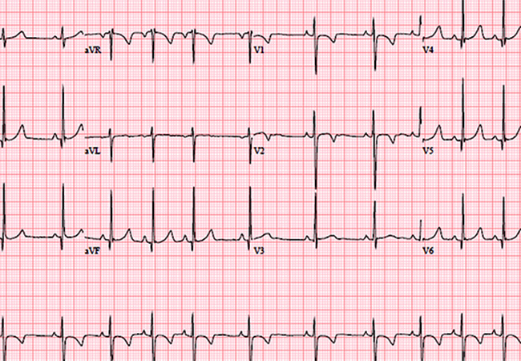

Solving Hard Medical Problems: Enter Computers (Images)
========================================================

- Images 

 
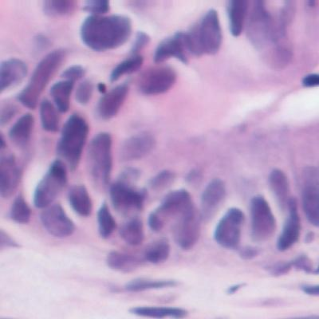

Okay, So This Only Works for MRIs?
========================================================

No. There are multiple subfields of Computer Aided Diagnosis (CAD). 

The focus of today 

- Radiomics (smaller part)
  - MRI, Xray, CT
- Histomics (larger part)
  - Biopsy slides

Some Image Procesing Terminology
========================================================

Images are 2D extensions of 1D signals. 

Some Terminology: 

- Filter
  - Remove, suppress, or alter something about the signal
- Features
  - Something about the signal, physical or not
- Textures
  - Quantifying a percieved texture of an image
  
  
Tools of the Trade
========================================================

- Unsupervised
  - Segmentation
  - Clustering
  - Dimensionality Reduction
  - Converting Colorspaces
  - Filtering and Feature Extraction
  - Blob Detection & Connected Components
  
***
- Supervised
  - Decision Trees
  - Regressions
  - Random Forests
  - Neural Networks
  
  
Filtering
========================================================

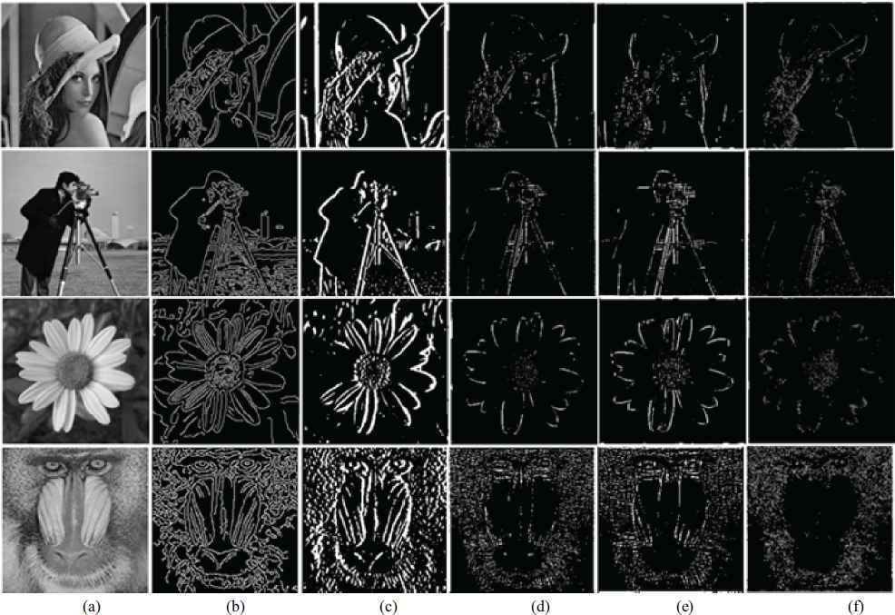

Features
========================================================

Textures
========================================================
  

Image Segmentation
========================================================

Segmentation is the process of splitting an image into meaningful parts.

Brain MRI[3]: 

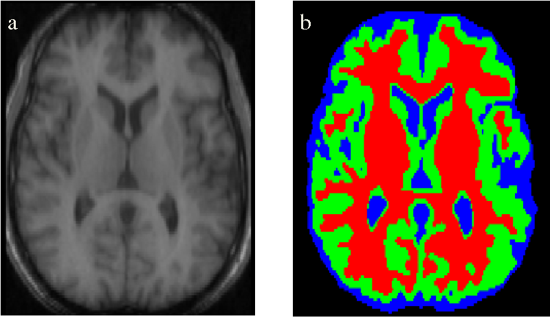

Color Spaces
========================================================
  
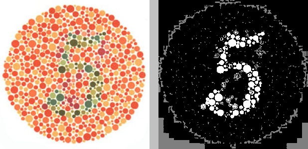

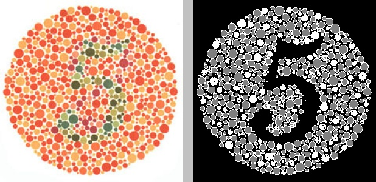

Deconvolution 
========================================================
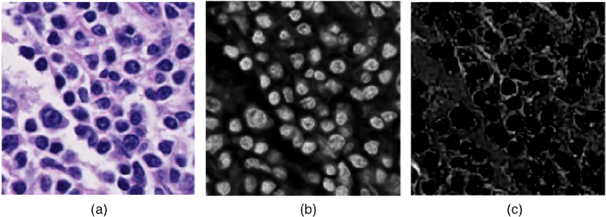

  
Typical Workflow For Prediction
========================================================

- Extract features from the image
  - The interesting part!
    - Choice of features impacts how your work will be used in hospitals
- Predict something
  - Survival, treatment success, tumor volume, etc
  
  
Review of Important Parts of Animal Cells
========================================================

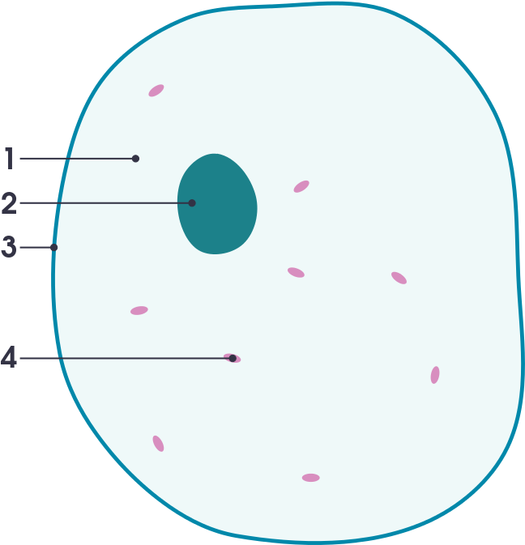

Visual Intro to H&E Slides
========================================================

*** 
This is an example of a histology slide with a hematoxylin and eosin (H&E) stain. 

Visually, 
- Cell Nuclei = Purple
- Cytoplasm = Pink

A Real Image
========================================================

Takeaway: Suspect cancer if there is a lot of purple in one place and there is no organization of cells.
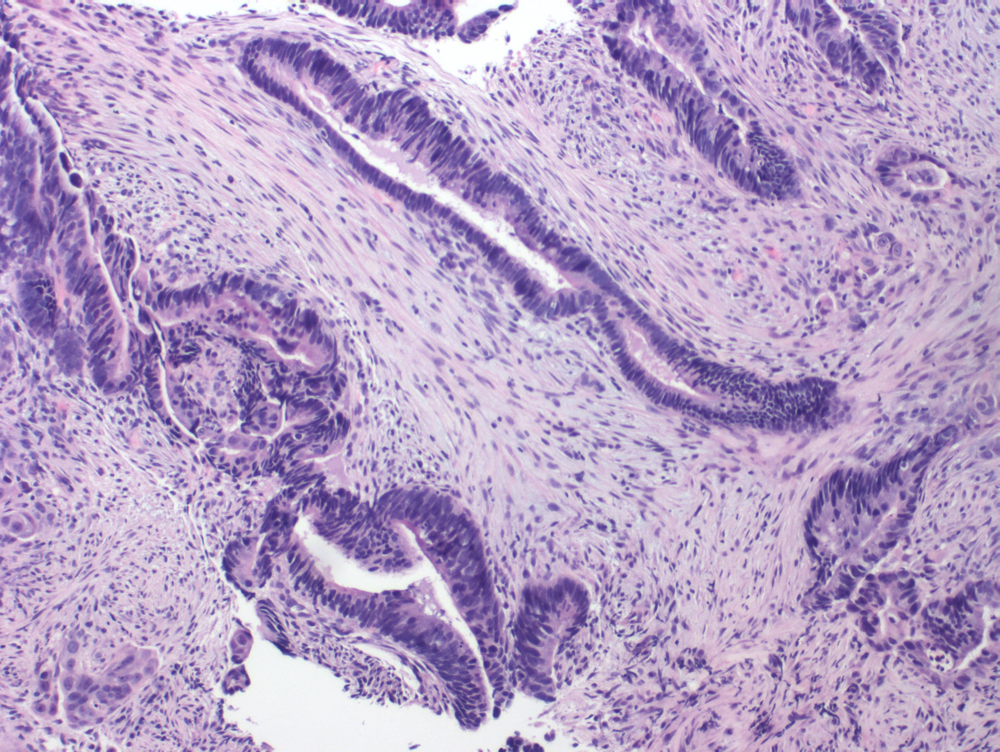

Basic Biological Features to Predict Cancer Severity
========================================================

- Cell Counting
- Cell Density

But how do you computationally find the cells?

Cell Segmentation
========================================================

A couple methods
  - Color deconvolution
  - Converting to another color space
  
  
Example 
========================================================

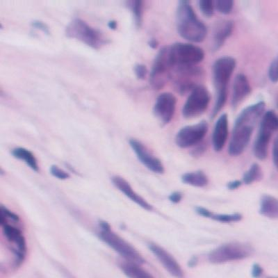
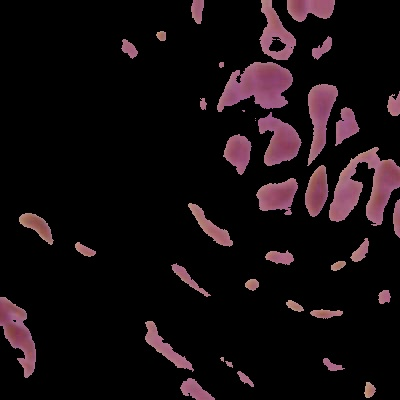

Convert to HSV then KMeans cluster (k = 4)

That's Pretty Cool... For One Image
========================================================
 
For classification of whole images, you have options:
  - Work with image features
    - Pros: 
      - Can lead to less complex, more explainable models
    - Cons: 
      - Might not be as accurate
  - Work with the whole images
    - Pros: 
      - Typically more accurate
      - Can be arbitrarily complex
    - Cons: 
      - Difficult to explain
      
      
Computer Aided Diagnosis is a Balancing Act
========================================================

Doctors, and patients, want to know how a diagnosis was reached.

If the model is too complex, doctors
- Won't understand it
- Won't use it

Back to the Motivating Example
========================================================

Together is better.

References
========================================================

[1] Prasanna, Prateek et al. “Co-occurrence of Local Anisotropic Gradient Orientations (CoLlAGe): A new radiomics descriptor.” Scientific reports vol. 6 37241. 22 Nov. 2016, doi:10.1038/srep37241

[2] Pallavi, Tiwari et al. “Texture Descriptors to distinguish Radiation Necrosis from Recurrent Brain Tumors on multi-parametric MRI.” Proceedings of SPIE--the International Society for Optical Engineering vol. 9035 (2014): 90352B. doi:10.1117/12.2043969

[3] Withey, Daniel J. and Zoltan J. Koles. “A Review of Medical Image Segmentation: Methods and Available Software.” (2008).

